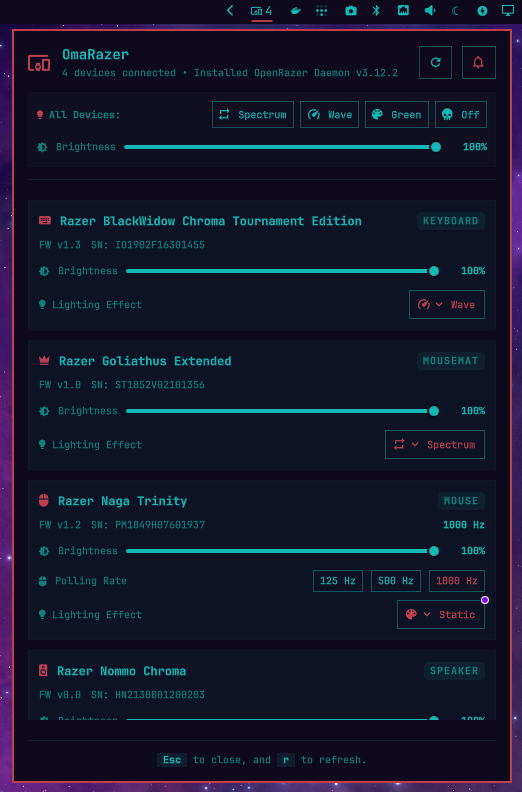

# OmaRazer - OpenRazer Devices Plugin for Omarchy

An Omarchy shell bar widget and panel plugin that connects to the [OpenRazer](https://openrazer.github.io/) daemon to monitor and manage connected Razer peripherals (keyboards, mice, mousemats, headsets, and accessories).

<p align="center">
  
</p>

## Benefits

- **At-a-Glance Status in Your Bar**: Instantly see connected device counts and battery states right from the Omarchy status bar without cluttering your workspace.
- **Native & Lightweight Performance**: Fast, native QML interface powered by Quickshell — no bloated background web runtimes or heavy Electron applications required.
- **Instant Lighting & Profile Switching**: Adjust RGB lighting effects, colors, brightness, animation speeds, and global presets in seconds with immediate hardware response.
- **Wireless Battery Awareness**: Color-coded battery level indicators and charging status prevent your wireless mice and headsets from running out of power mid-game or mid-work.
- **Keyboard-First Ergonomics**: Designed for tiling window manager workflows with full keyboard navigation, quick shortcuts (`Esc` to close, `r` to refresh), and mouse controls.
- **Self-Healing & Diagnostic Tools**: Live daemon connectivity checks with one-click restart actions if the OpenRazer background service is stopped.
- **Scriptable CLI Automation**: Includes a standalone Python CLI tool for automating lighting profiles, polling rates, and brightness via scripts or custom keybindings.

## Features

- **Device Discovery & Status**: Automatically detects all connected Razer devices via the OpenRazer daemon.
- **Hardware Telemetry**: Displays device names, device types, serial numbers, and firmware versions.
- **Battery Monitoring**: Live battery percentage and charging state indicators with color-coded levels for wireless devices.
- **Lighting Effect Configurations**:
  - **Categorized Per-Device Effect Organization**: Grouped into logical categories (**Presets**, **Dynamic**, and **Interactive**) displaying only the lighting effects supported by each peripheral.
  - **Structured Effect Settings**: Dedicated settings card for the active effect with context-aware parameter controls:
    - Primary RGB color palette swatches with active selection indicator.
    - Secondary RGB color palette swatches for dual-color effects (Dual Breathing, Dual Starlight).
    - Wave direction selector (Left / Right).
    - Easily accessible animation & reaction speed controls with active selection highlighting (Fast / Normal / Slow / Very Slow).
    - Dedicated sub-mode switchers for Breathing (Single / Random / Dual), Ripple (Single / Random), and Starlight (Random / Single / Dual).
  - **Interactive Effect Toggles**: Collapsible per-device effect cards toggled by clicking the active effect badge.
  - **Global Quick Presets**: Quick lighting presets for all devices simultaneously (Spectrum, Wave, Razer Green, Off).
- **DPI & Polling Rate**: Displays active mouse DPI configuration and polling rate (Hz).
- **Brightness Control**: Inline brightness sliders for devices with lighting support.
- **Bar Widget**: Shows Razer status icon and connected device count on the Omarchy status bar with hover tooltip summaries.
- **Keyboard Navigation & Shortcuts**: Supports full keyboard navigation, `Esc` to close, and `r` to refresh.
- **Daemon Diagnostics**: Clear error reporting and one-click daemon restart if the daemon is offline.

## Requirements & External Dependencies

- **Omarchy Linux** (Quattro shell with plugin support)
- **OpenRazer Daemon & Python Client**:
  - `openrazer-daemon`
  - `python-openrazer`
- Ensure your user is in the `openrazer` group and the daemon service is running:
  ```bash
  sudo gpasswd -a "$USER" openrazer
  systemctl --user enable --now openrazer-daemon
  ```


## Installation

Add and enable the plugin directly in Omarchy:

```bash
omarchy plugin add https://github.com/asdfsnlr/omarazer.git --enable
```

Or install and enable locally for development:

```bash
mkdir -p ~/.config/omarchy/plugins
cp -r "$PWD" ~/.config/omarchy/plugins/asdfsnlr.omarazer
omarchy plugin enable asdfsnlr.omarazer --section right
```

## Removal

To disable or remove the plugin from Omarchy:

```bash
# Disable without uninstalling
omarchy plugin disable asdfsnlr.omarazer

# Remove the plugin
omarchy plugin remove asdfsnlr.omarazer
```

Or remove manually if installed locally:

```bash
omarchy plugin disable asdfsnlr.omarazer
rm -rf ~/.config/omarchy/plugins/asdfsnlr.omarazer
```

## Configuration

The widget supports configuration via Omarchy plugin settings (`manifest.json` schema) and the Omarchy bar CLI:

- `pollIntervalSec` / `refreshIntervalSec` (*integer*, default: `30`): Polling and refresh interval in seconds to refresh device status (min: `5`, max: `300`).
- `showCountInBar` (*boolean*, default: `true`): Whether to show the connected device count next to the icon in the bar.

### Changing the Refresh Interval

You can configure how frequently OmaRazer refreshes device status using any of the following methods:

#### 1. Using the Omarchy Bar CLI

Use `omarchy bar set` to dynamically update the refresh interval (e.g., to 15 seconds):

```bash
# Set refresh interval using pollIntervalSec
omarchy bar set asdfsnlr.omarazer pollIntervalSec 15

# Or using the refreshIntervalSec alias
omarchy bar set asdfsnlr.omarazer refreshIntervalSec 15
```

#### 2. Editing `~/.config/omarchy/shell.json`

Add `pollIntervalSec` (or `refreshIntervalSec`) directly to your OmaRazer bar layout entry in `~/.config/omarchy/shell.json`:

```json
{
  "bar": {
    "layout": {
      "right": [
        {
          "id": "asdfsnlr.omarazer",
          "pollIntervalSec": 15,
          "showCountInBar": true
        }
      ]
    }
  }
}
```

#### 3. Manual On-Demand Refresh

To trigger an immediate refresh without waiting for the next polling interval:
- **Bar Widget**: Middle-click the OmaRazer bar icon.
- **Panel Shortcut**: Press <kbd>r</kbd> or <kbd>R</kbd> while the OmaRazer panel is focused.
- **Panel Header**: Click the refresh button (**󰑐**) in the panel header.

## CLI Usage

The plugin includes a standalone Python CLI scanner and management script (`scripts/razer_devices.py` or `main.py`):

```bash
# Print JSON output
python3 scripts/razer_devices.py

# Print human-readable terminal summary
python3 scripts/razer_devices.py --summary

# Set lighting effects (device serial or 'all')
python3 scripts/razer_devices.py --set-effect <serial|all> static "#00ff00"
python3 scripts/razer_devices.py --set-effect <serial|all> spectrum
python3 scripts/razer_devices.py --set-effect <serial|all> wave 1
python3 scripts/razer_devices.py --set-effect <serial|all> breath "#8000ff"
python3 scripts/razer_devices.py --set-effect <serial|all> none

# Set brightness for a specific device or all devices (0-100)
python3 scripts/razer_devices.py --set-brightness <serial|all> 75

# Set polling rate (Hz) for a device
python3 scripts/razer_devices.py --set-poll-rate <serial> 1000
```

## Running Tests

Run the test suites and validations:

```bash
# Run Python unit tests
python3 -m unittest discover tests

# Run JavaScript Model tests
node tests/test_model.js

# Validate manifest schema
omarchy plugin validate .

# Lint QML syntax
qmllint -I /usr/share/omarchy/shell ./Panel.qml
```

## License

This project is licensed under the MIT License. See [LICENSE](LICENSE) for details.
